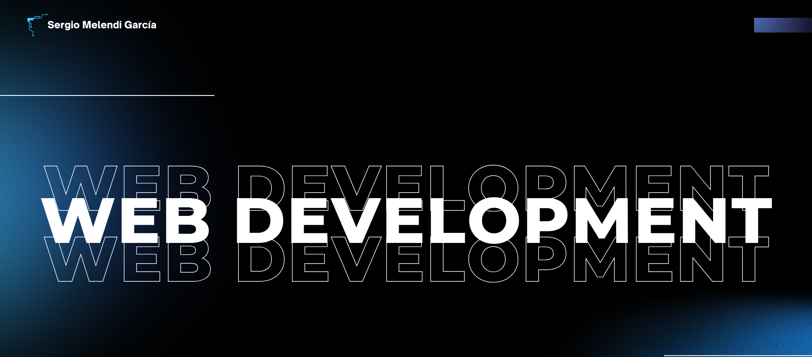

    <h1>Hi there, I´m Sergio 👋</h1>

    

<h3>
    web development student, learning technologies like HTML, CSS, JavaScript, PHP, MySQL, and Git.
     
    I am passionate about creating projects and improving my skills to contribute to the world of web development.
</h3>

## Mis objetivos
- Learning to work with frameworks like React or Angular ⚛️
- To contribute to open source projects 🌍
- Get my first job as junior developer 👨‍💻

    <h2>Connect with me 🤝</h2>

    
    
    

